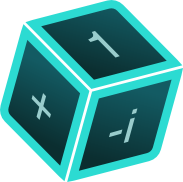

# «Суперпозиция» версия для платы

<p align="center">
  
</p>

<p align="center">
  <a href="https://platformio.org/"></a>
  <a href="https://www.arduino.cc/"></a>
  <a href="https://isocpp.org/"></a>
  <a href="https://nfc-forum.org/"></a>
  <a href="https://react.dev/"></a>
  <a href="https://www.typescriptlang.org/"></a>
  <a href="https://vite.dev/"></a>
</p>

Прошивка платы и веб-клиент для игры «Суперпозиция». Плата на ESP32 держит всю игровую логику: раздаёт Wi-Fi, обслуживает веб-клиент из собственной памяти, принимает ходы по WebSocket и считывает физические карты NFC-ридером PN532. Проект использует игровые модели и отрисовку оригинальной игры «Суперпозиция».

В репозитории две части: прошивка контроллера на C++ для Arduino ([controller](controller)) и веб-клиент на React ([front](front)).

## Содержание

- [Возможности](#возможности)
- [Как проходит партия](#как-проходит-партия)
- [Состав репозитория](#состав-репозитория)
- [Требования](#требования)
- [Сборка и прошивка](#сборка-и-прошивка)
- [Подключение к плате](#подключение-к-плате)
- [Структура проекта](#структура-проекта)
- [Текущие ограничения](#текущие-ограничения)
- [Если что-то не работает](#если-что-то-не-работает)

## Возможности

- Полная игровая логика на контроллере: регистры из кубитов, 21 тип карт с автоматически применяемыми эффектами, проверка победы.
- Физические карты: RFID-метки считываются ридером PN532, привязка метки к типу карты хранится в энергонезависимой памяти платы и дубливуется в NDEF сообщении в памяти самой метки.
- Wi-Fi без роутера: плата поднимает собственную точку доступа, клиенты подключаются напрямую.
- Веб-клиент из памяти платы: HTTP-сервер отдаёт собранный фронтенд из файловой системы SPIFFS.
- Захват DNS: после подключения к точке доступа любой URL открывает веб-клиент — набирать адрес не нужно.
- WebSocket-сервер: лобби, имена игроков, синхронизация состояния партии, до 8 одновременных подключений.

## Как проходит партия

1. Включите плату — она поднимет точку доступа `BoardGame` (пароль `boardgame`).
2. Подключитесь к ней с телефона или компьютера и откройте любой сайт: DNS платы перенаправит запрос на веб-клиент.
3. В лобби задайте имена, выберите соперника и параметры партии — плата создаст регистры и разошлёт стартовое состояние.
4. Раздайте игрокам по 6 зарегистрированных карт с метками.
5. В свой ход выберите целевой кубит на экране и приложите карту к NFC-ридеру — плата применит эффект карты и разошлёт новое состояние всем игрокам.
6. Когда регистр игрока совпадёт с целевым, плата объявит победителя и завершит партию.

## Состав репозитория

| Путь | Описание |
|---|---|
| [controller](controller) | Прошивка платы: проект PlatformIO на C++ для Arduino |
| [front](front) | Веб-клиент на React + TypeScript + Vite |
| [deployFirmware.ps1](deployFirmware.ps1) | Сборка и прошивка контроллера |
| [deployFrontend.ps1](deployFrontend.ps1) | Сборка веб-клиента и загрузка его в память платы |
| [RULES.md](RULES.md) | Правила игры |
| [CARDS.md](CARDS.md) | Список карт |
| [EVENTS.md](EVENTS.md) | Протокол WebSocket-событий |

## Требования

| Компонент | Требование |
|---|---|
| Плата | ESP32 DevKit v1 (DOIT) |
| NFC-ридер | Adafruit PN532, подключение I²C: SDA — пин 21, SCL — пин 22, сигнал — пин 17 |
| Прошивка | PlatformIO с платформой espressif32 (Arduino); библиотеки ставятся из `platformio.ini` |
| Веб-клиент | Node.js с npm |

> [!NOTE]
> Скрипты сами находят `pio` в `%USERPROFILE%\.platformio\penv\Scripts\pio.exe` — PlatformIO не обязательно добавлять в PATH.

## Сборка и прошивка

Прошивка контроллера:

```powershell
.\deployFirmware.ps1              # сборка и загрузка в плату
.\deployFirmware.ps1 -SkipUpload  # только проверить сборку
```

Веб-клиент (сборка, оптимизация картинок и запись в файловую систему платы):

```powershell
.\deployFrontend.ps1              # сборка фронта и загрузка в SPIFFS
.\deployFrontend.ps1 -SkipUpload  # только собрать и подготовить controller/data
```

Скрипт сборки фронта сам следит за лимитом памяти: сжимает картинки, а если результат не влезает в SPIFFS-партицию — падает с ошибкой до прошивки.

## Подключение к плате

После запуска плата поднимает точку доступа `BoardGame` с паролем `boardgame` ([main.cpp](controller/src/main.cpp)). HTTP-сервер на порту 80 отдаёт веб-клиент из SPIFFS, DNS-сервер на порту 53 перенаправляет любые домены на плату ([web_server.cpp](controller/src/web_server.cpp)), поэтому клиент открывается по любому адресу. IP платы печатается в Serial при старте, обычно это `192.168.4.1`.

## Обмен сообщениями

Игровые события ходят по WebSocket на порту 81 ([ws_controller.cpp](controller/src/ws_controller.cpp)).
Сообщения WebSocket передаются в формете текстового JSON-документа и имеют поля:
- `event` – строка, определяющая случившееся сообщение
- `data` - данные, связанные с событием. Формат зависит от контретного события

Более подробно API описан в [EVENTS.md](EVENTS.md).

## Структура проекта

```text
QuantumGame/
├── controller/              прошивка платы (PlatformIO, C++/Arduino)
│   ├── src/
│   │   ├── die              модель кубика
│   │   ├── register         регистры и кубиты
│   │   ├── game_state       состояние партии
│   │   ├── card_effects     эффекты 21 карты
│   │   ├── card_registry    реестр RFID-меток (NVS)
│   │   ├── game_controller  ходы, события, победа
│   │   ├── nfc_scanner      считывание меток PN532
│   │   ├── ndef_helper      NDEF-записи
│   │   ├── wifi_share       NFC-раздача Wi-Fi-конфига
│   │   ├── ws_controller    WebSocket-сервер (порт 81)
│   │   ├── web_server       точка доступа, DNS, HTTP (порт 80)
│   │   └── main             точка входа
│   ├── data/                собранный веб-клиент для SPIFFS
│   └── platformio.ini       окружение и библиотеки
├── front/                   веб-клиент (React + TypeScript + Vite)
│   └── src/
│       ├── api/             WebSocket, события, статус соединения
│       ├── pages/           лобби, партия, профиль, история, справка
│       ├── components/      UI-компоненты
│       ├── game/            игровые модели для интерфейса
│       └── assets/          карты, грани кубика, логотип, музыка
├── hand_tracker.py          консольный трекер рук
├── deployFirmware.ps1       прошивка контроллера
└── deployFrontend.ps1       сборка и загрузка веб-клиента
```

## Текущие ограничения

- До 8 одновременных WebSocket-подключений.
- Руки и колода не отслеживаются платой: добор контролируют игроки.
- Проверка повторного проигрывания одной и той же карты временно отключена в целях тестирования.
- Веб-клиент ограничен партицией SPIFFS 1408 КБ.

## Если что-то не работает

- **Плата не поднимает точку доступа.** Откройте Serial-монитор на 9600 бод — при старте плата печатает IP и статус запуска.
- **Веб-клиент не открывается.** Убедитесь, что телефон или компьютер подключены к Wi-Fi `BoardGame`, и попробуйте открыть `http://192.168.4.1` напрямую.
- **Сервер отвечает `index.html not found`.** В SPIFFS нет сборки фронта — выполните `.\deployFrontend.ps1`.
- **Карта не считывается.** Проверьте подключение PN532 по I²C: SDA — пин 21, SCL — пин 22, сигнал — пин 17, и что метка привязана к карте через запись в реестр.
- **WebSocket не подключается.** Плата принимает соединения на порту 81, максимум 8 клиентов — отключите лишние вкладки.
